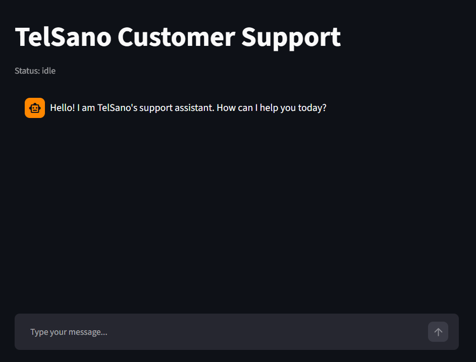
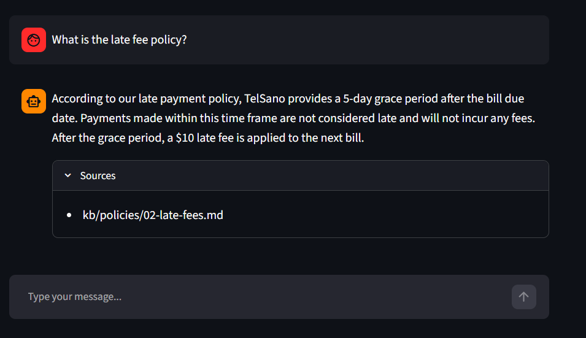
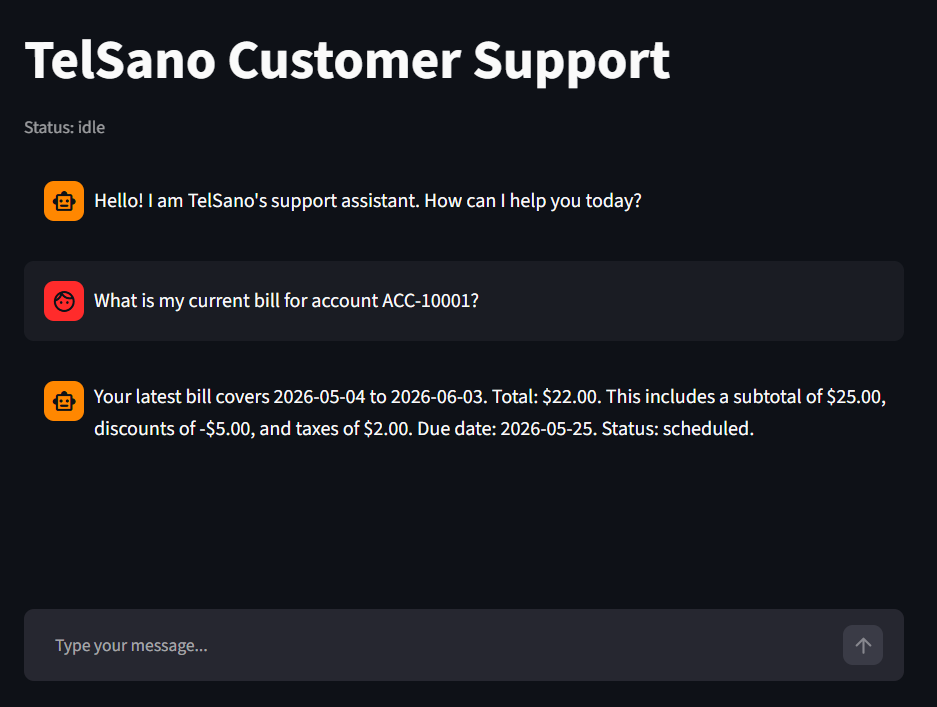
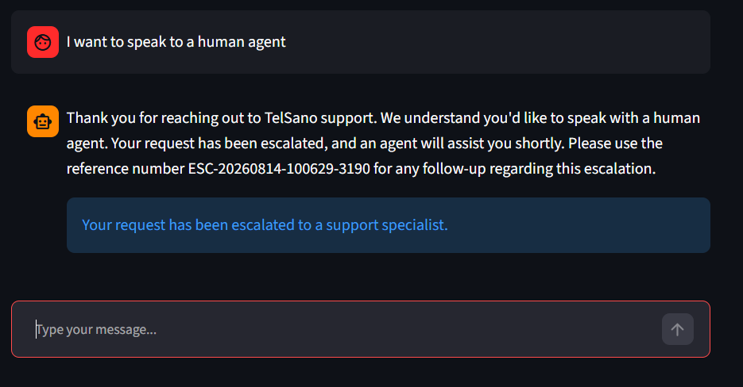

# TelSano Customer Service Copilot

[](https://github.com/Git-Hub-Ran/telecom-ops-copilot/actions/workflows/tests.yml)

TelSano Copilot is a customer service AI agent for a US telecom provider. It handles
inbound customer queries across four domains (billing, account management, technical
support, and general information) through a deterministic 5-state pipeline backed by
Azure AI Foundry agents. Routing, tool execution, escalation, and response generation
are fully automated; a Streamlit chat interface exposes the pipeline for direct
customer interaction.

The project demonstrates a production-ready pattern for single-orchestrator pipeline:
strict separation between deterministic routing (pure Python) and model-dependent work
(Foundry agents), structured JSON logging throughout, and a 100-query golden set eval
with measurable pass/fail criteria.

## Architecture

Each customer message passes through five states in sequence:

1. **ClassifyState** (gpt-4o-mini Foundry agent): detects intent (billing, technical,
   account, info, escalate, or unknown), confidence score, detected emotion, and
   off-topic flag.
2. **RouteState** (pure Python, no LLM): maps ClassifyOutput to a RoutingDecision
   enum value using priority rules. Unknown intent routes to a clarifying question.
   Injection attempts are classified as `intent="escalate"` by the classifier and
   route to escalation directly.
3. **ActState**: calls Python tool functions directly for billing, account, and
   technical paths; invokes a gpt-4o Foundry agent with file_search for info queries.
4. **EscalateState** (gpt-4o Foundry agent): assembles and persists a human handoff
   ticket when ActState returns unresolved or when routing bypasses Act entirely.
5. **RespondState** (gpt-4o Foundry agent): generates the final customer-facing
   message from the full context accumulated across prior states.

**Key technology choices:**
- Azure AI Foundry: agent hosting, runs, and file_search KB retrieval
- Azure OpenAI gpt-4o-mini: intent classification (latency-sensitive, lower cost)
- Azure OpenAI gpt-4o: act, escalate, and respond agents
- Streamlit: chat UI with session state and conversation history
- Pydantic v2: data models and config validation
- DeviceCodeCredential: interactive auth that works in all environments

RouteState is the only stateless, model-free component. It applies priority rules
to map ClassifyOutput to a RoutingDecision enum value. Unknown intent routes to a
clarifying question. Injection attempts are classified as `intent="escalate"` by the
classifier and route to escalation directly. The injection defence relies on the
classifier labelling attacks as `escalate`, not on the unknown routing path.

## Quick start

**Requirements:** Python 3.12+

```bash
pip install -r requirements.txt
```

Create a `.env` file in the project root:

```
AZURE_FOUNDRY_PROJECT_ENDPOINT=https://<project>.api.azureml.ms/...
AZURE_TENANT_ID=<your-tenant-id>
VECTOR_STORE_ID=<your-vector-store-id>
```

All other settings have defaults. See `src/config.py` for the full config schema.

**First run:** On startup, AgentFactory creates the four Foundry agents automatically
using get-or-create semantics (list agents by name; create only if absent). No manual
agent provisioning is required. Authentication uses Device Code flow; follow the
terminal prompt to sign in.

```bash
streamlit run src/ui/app.py
```

**Updating prompts:** Foundry agents are retrieved by name. After changing a system
prompt in `src/orchestrator/agents/prompts.py`, delete the corresponding agent in the
Azure Foundry portal so it is recreated with the updated instructions on the next run.
Agent names: `classifier-agent`, `act-agent`, `escalate-agent`, `respond-agent`.

**Tests:** No Azure credentials required. All 330 tests use mocks.

```bash
pytest tests/
```

## Screenshots

**Welcome screen**


**KB-grounded answer with citations**


**Billing query with formatted amounts**


**Escalation with ticket reference**


## Eval results

Baseline evaluation against a 100-query golden set (standard and adversarial queries).
Full analysis in [`eval/BASELINE_NOTES.md`](eval/BASELINE_NOTES.md).

| Metric | Score | Target | Status |
|---|---|---|---|
| Intent accuracy | 86% | >=90% | FAIL |
| Tool selection | 82.9% | >=85% | FAIL |
| Escalation precision | 86.7% | >=85% | PASS |
| Escalation recall | 92.9% | >=80% | PASS |
| Latency p95 | ~20s | <=5s | FAIL (structural, see below) |

Intent accuracy uses exact label matching. The classifier correctly identifies
injection attempts as `intent="escalate"`, which routes to escalation directly.
This behaviour is captured separately in escalation recall (92.9% PASS). The
two metrics are intentionally independent.

Remaining intent failures are hard adversarial cases (extreme vagueness,
multi-intent queries, abusive phrasing) and two genuine boundary ambiguities
between `info` and `account`. Tool selection failures follow directly from
intent misclassification. Full failure analysis in
[`eval/BASELINE_NOTES.md`](eval/BASELINE_NOTES.md).

## Known constraints

**Latency:** p50 is approximately 11s; p95 is approximately 20s. Each query requires
2-3 sequential Foundry agent runs, and each run involves polling until completion
(create thread, post message, start run, poll, fetch response). The 5s p95 target
requires replacing the polling Agents API with streaming Azure OpenAI Chat Completions
for agents that do not use file_search. This is a documented architectural tradeoff,
not a tuning problem.

**Model deprecation:** gpt-4o and gpt-4o-mini retire October 1 2026. Before that
date, update `CLASSIFIER_MODEL`, `ACT_MODEL`, `ESCALATE_MODEL`, and `RESPOND_MODEL`
in `.env` to point to supported model deployments.

**Intent accuracy ceiling:** Further refinement of the classifier prompt risks
regressions on boundary cases. Injection-attempt queries are correctly deflected by
the routing layer (they escalate to a human agent regardless of the intent label), so
the metric gap does not represent a functional failure for those cases.

**No identity verification:** account IDs are accepted from customer messages without authentication.

## Project structure

```
src/
  config.py                    Pydantic settings, loaded from .env
  orchestrator/
    state_machine.py           5-state pipeline coordinator
    states/                    One module per state (classify, route, act, escalate, respond)
    agents/
      factory.py               Get-or-create Foundry agent provisioning
      prompts.py               System prompts for all four agents
    models/                    Pydantic data models (StateContext, SessionState, etc.)
    observability/
      structured.py            Structured JSON logging to stdout (FR-047 to FR-052)
  tools/                       Python tool functions (billing, account, diagnostic, outage, escalation)
  ui/
    app.py                     Streamlit chat interface

tests/                         330 unit tests, no Azure dependency
eval/
  golden_set.csv               100-query evaluation set
  BASELINE_NOTES.md            Eval scores and failure analysis
mock-data/                     JSON fixture files for tool functions
notebooks/
  03-evaluation.ipynb          End-to-end eval runner
docs/
  ARCHITECTURE.md
  BUSINESS_CASE.md
  DEPLOYMENT.md
  ESCALATION_SCHEMA.md
  EVAL.md
  KB_NOTES.md
  PLAN.md
  TROUBLESHOOTING.md
```
